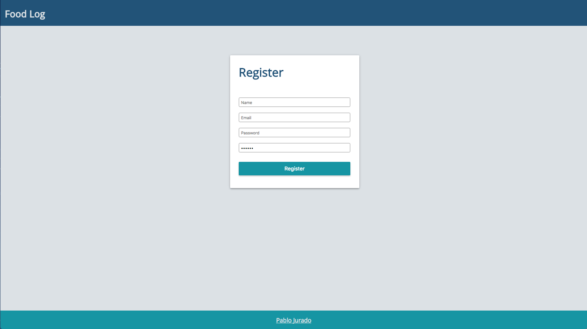
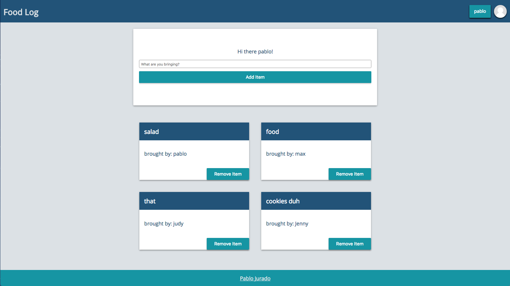
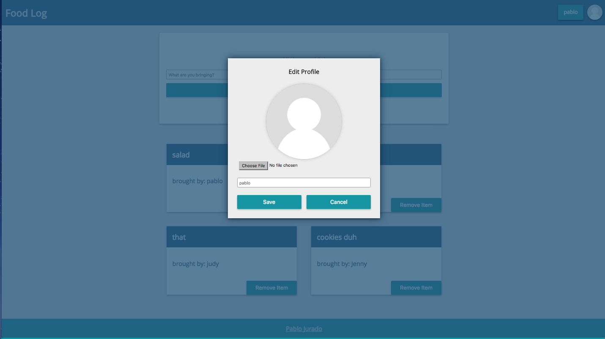

# Food Log App

This project was bootstrapped with [Create React App](https://github.com/facebookincubator/create-react-app)
and deploy with [Surge](http://surge.sh/)


> App status: work in progress

This React App is a food log that keeps track of items when having a potluck party.
Uses Firebase for user authentication, profile images, and database.

[Link](http://food-log.surge.sh/)






## Tech/framework used

Built with:
* [React] with [functional, stateless components]
* [Firebase]
* Vanilla CSS
* ES6 with Babel


## Development Setup

```sh
# In the project directory, you can run:

npm start

# Runs the app in the development mode.
# Open http://localhost:3000 to view it in the browser.

# The page will reload if you make edits.
# You will also see any lint errors in the console.

npm run build

# Builds the app for production to the build folder.
# It correctly bundles React in production mode and optimizes the build for the best performance.

# The build is minified and the filenames include the hashes.
# Your app is ready to be deployed!
```

## Credits

[Pablo Jurado](http://www.pablojurado.com)


[Paint]:https://en.wikipedia.org/wiki/Microsoft_Paint
[persistent data structure]:https://en.wikipedia.org/wiki/Persistent_data_structure
[React]:https://facebook.github.io/react/
[functional, stateless components]:https://facebook.github.io/react/docs/components-and-props.html#props-are-read-only
[Firebase]:https://firebase.google.com/
